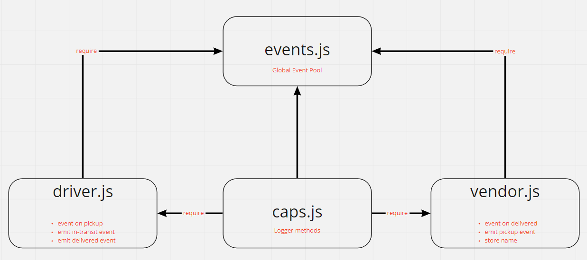

# LAB - Class 16

## Project: CAPS

### Author: Abdulhakim Zatar

### Links and Resources

- [ci/cd](https://github.com/zatar-401-advanced-javascript/caps/actions) (GitHub Actions)

### Setup

#### `.env` requirements (where applicable)

i.e.

- `STORE_NAME` - Store name

#### How to initialize/run your application (where applicable)

- `npm i dotenv faker`
- e.g. `npm start`

#### How to use your library (where applicable)

#### Tests

- `npm i -D eslint jest`

#### UML

